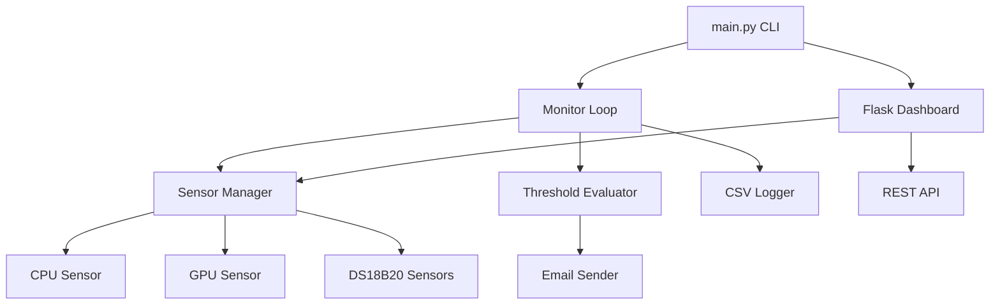
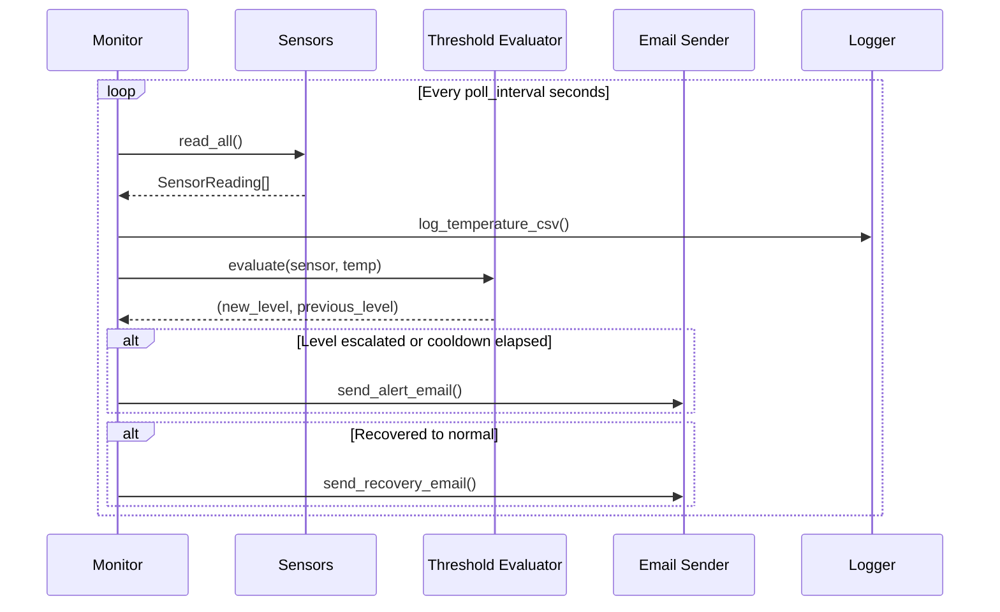
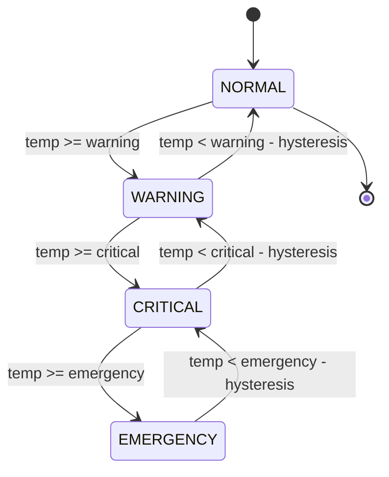

# Pi Temperature Alerter

A comprehensive Raspberry Pi temperature monitoring and alerting system. Monitors CPU, GPU, and external DS18B20 sensors with configurable email alerts, hysteresis-based threshold evaluation, and a real-time web dashboard.

## Features

- Multi-sensor support: CPU (thermal_zone), GPU (vcgencmd), DS18B20 (one-wire)
- Tiered alerting: Warning, Critical, and Emergency thresholds with per-level recipients
- Hysteresis: Prevents alert flapping when temperature oscillates around a threshold
- Cooldown: Rate-limits repeated alerts to avoid inbox flooding
- Recovery notifications: Alerts when temperature returns to normal
- Web dashboard: Real-time Chart.js graphs with auto-refresh
- CSV logging: Historical temperature data with configurable rotation
- Systemd integration: Auto-start on boot with security hardening
- Self-update: Pull latest changes and restart via CLI
- Dry-run mode: Test alert logic without sending emails
- Production deployment: Installs to /opt with dedicated service user
- Fully configurable via a single `.env` file

## Architecture



## Monitoring Flow



## Alert State Machine



## Production Installation

The application installs to `/opt/pi-temp-alerter` with a dedicated system user, systemd service, and hardened file permissions.

### Prerequisites

- Raspberry Pi (any model) running Raspberry Pi OS
- Python 3.11 or later
- Git installed
- Network access (for sending emails)

### Install

```bash
# Clone the repository
git clone https://github.com/your-user/Pi-Temperature-Alerter.git
cd Pi-Temperature-Alerter

# Run the installer (requires root)
sudo ./install.sh
```

The installer will:

1. Create a dedicated `pi-temp-alerter` system user (no login shell)
2. Copy application files to `/opt/pi-temp-alerter`
3. Create a Python virtual environment and install dependencies
4. Set restrictive file permissions (`.env` is chmod 600)
5. Install and enable the systemd service
6. Create a `.env` from the template if one does not exist

### Post-Install Configuration

```bash
# Edit configuration
sudo nano /opt/pi-temp-alerter/.env

# Test email delivery
sudo -u pi-temp-alerter /opt/pi-temp-alerter/venv/bin/python /opt/pi-temp-alerter/main.py test-email

# Start the service
sudo systemctl start pi-temp-alerter

# Check status
sudo systemctl status pi-temp-alerter
```

### Uninstall

```bash
sudo ./uninstall.sh
```

The uninstaller will:

1. Stop and disable the systemd service
2. Remove the service file
3. Optionally preserve logs and data directories
4. Remove the application files from `/opt`
5. Remove the service user

### Updating

```bash
sudo /opt/pi-temp-alerter/venv/bin/python /opt/pi-temp-alerter/main.py update
```

Or from the cloned repository:

```bash
sudo python main.py update
```

The update command will:

1. Pull the latest changes via `git pull --ff-only`
2. Reinstall Python dependencies
3. Restart the systemd service if it is running

## Development Setup

For local development and testing (not production):

```bash
# Clone and enter the repository
git clone https://github.com/your-user/Pi-Temperature-Alerter.git
cd Pi-Temperature-Alerter

# Create virtual environment
python3 -m venv venv
source venv/bin/activate

# Install dependencies
pip install -r requirements.txt

# Create configuration
cp .env.example .env
nano .env

# Run directly
python main.py start
```

## CLI Reference

| Command       | Description                                          | Options                          |
|---------------|------------------------------------------------------|----------------------------------|
| `start`       | Start the monitoring daemon                          | -                                |
| `status`      | Show current sensor readings                         | -                                |
| `history`     | Display recent temperature history                   | `-n`, `--lines` (default: 20)   |
| `test-email`  | Send a test email to verify SMTP config              | -                                |
| `config`      | Display current configuration                        | -                                |
| `update`      | Pull latest changes and restart service (requires root) | -                             |

All commands are invoked via:

```bash
python main.py <command> [options]
```

Use `--help` on any command for usage details:

```bash
python main.py --help
python main.py history --help
```

## Configuration Reference

All configuration is managed through the `.env` file. Copy `.env.example` to `.env` and adjust.

### SMTP Settings

| Field           | Type   | Default          | Description                              |
|-----------------|--------|------------------|------------------------------------------|
| SMTP_HOST       | string | smtp.gmail.com   | SMTP server hostname                     |
| SMTP_PORT       | int    | 587              | SMTP server port                         |
| SMTP_USE_TLS    | bool   | true             | Enable STARTTLS                          |
| SMTP_USERNAME   | string | -                | SMTP authentication username             |
| SMTP_PASSWORD   | string | -                | SMTP authentication password/app key     |
| EMAIL_FROM      | string | -                | Sender address for outgoing emails       |

### Recipients

| Field                      | Type         | Default | Description                              |
|----------------------------|--------------|---------|------------------------------------------|
| EMAIL_RECIPIENTS_WARNING   | comma-list   | -       | Recipients for warning-level alerts      |
| EMAIL_RECIPIENTS_CRITICAL  | comma-list   | -       | Recipients for critical-level alerts     |
| EMAIL_RECIPIENTS_EMERGENCY | comma-list   | -       | Recipients for emergency-level alerts    |

### Temperature Thresholds

| Field           | Type  | Default | Description                                         |
|-----------------|-------|---------|-----------------------------------------------------|
| TEMP_WARNING    | float | 60.0    | Warning threshold in degrees Celsius                |
| TEMP_CRITICAL   | float | 70.0    | Critical threshold in degrees Celsius               |
| TEMP_EMERGENCY  | float | 80.0    | Emergency threshold in degrees Celsius              |
| TEMP_HYSTERESIS | float | 3.0     | Degrees below threshold before clearing alert state |

### Monitoring

| Field                  | Type | Default | Description                                      |
|------------------------|------|---------|--------------------------------------------------|
| POLL_INTERVAL          | int  | 30      | Seconds between sensor readings                  |
| ALERT_COOLDOWN         | int  | 300     | Minimum seconds between repeated alerts          |
| RECOVERY_NOTIFICATIONS | bool | true    | Send email when temperature returns to normal    |

### Sensors

| Field                 | Type   | Default                 | Description                            |
|-----------------------|--------|-------------------------|----------------------------------------|
| SENSOR_CPU_ENABLED    | bool   | true                    | Enable CPU temperature monitoring      |
| SENSOR_GPU_ENABLED    | bool   | true                    | Enable GPU temperature monitoring      |
| SENSOR_DS18B20_ENABLED| bool   | false                   | Enable DS18B20 one-wire sensors        |
| DS18B20_BASE_DIR      | string | /sys/bus/w1/devices     | Path to one-wire device directory      |

### Logging

| Field              | Type   | Default | Description                            |
|--------------------|--------|---------|----------------------------------------|
| LOG_LEVEL          | string | INFO    | Log level: DEBUG, INFO, WARNING, ERROR |
| LOG_MAX_SIZE_MB    | int    | 10      | Max log file size before rotation (MB) |
| LOG_BACKUP_COUNT   | int    | 5       | Number of rotated log files to keep    |
| CSV_LOGGING_ENABLED| bool   | true    | Enable CSV temperature history logging |

### Dashboard

| Field           | Type   | Default   | Description                          |
|-----------------|--------|-----------|--------------------------------------|
| DASHBOARD_ENABLED| bool  | true      | Enable the web dashboard             |
| DASHBOARD_HOST  | string | 0.0.0.0   | Dashboard bind address               |
| DASHBOARD_PORT  | int    | 5000      | Dashboard HTTP port                  |

### Advanced

| Field    | Type | Default | Description                                  |
|----------|------|---------|----------------------------------------------|
| DRY_RUN  | bool | false   | Log alerts without actually sending emails   |

## DS18B20 Sensor Setup

To use DS18B20 one-wire temperature sensors:

1. Connect the sensor data pin to GPIO4 (pin 7) with a 4.7k pull-up resistor to 3.3V
2. Enable the one-wire interface:

```bash
# Add to /boot/config.txt
dtoverlay=w1-gpio

# Reboot
sudo reboot
```

3. Verify the sensor is detected:

```bash
ls /sys/bus/w1/devices/28-*
```

4. Enable in `.env`:

```
SENSOR_DS18B20_ENABLED=true
```

## Gmail App Password Setup

If using Gmail as your SMTP provider:

1. Enable 2-Factor Authentication on your Google Account
2. Navigate to Google Account > Security > App passwords
3. Generate an app password for "Mail"
4. Use the generated 16-character password as `SMTP_PASSWORD` in `.env`

## Project Structure

```
Pi-Temperature-Alerter/
|-- main.py                  # CLI entry point
|-- requirements.txt         # Python dependencies
|-- install.sh               # Production installer (requires root)
|-- uninstall.sh             # Clean removal script (requires root)
|-- .env.example             # Configuration template
|-- systemd/
|   `-- pi-temp-alerter.service  # Systemd unit file
`-- src/
    |-- config.py            # Configuration loader
    |-- logger.py            # Logging and CSV setup
    |-- monitor.py           # Core monitoring loop
    |-- sensors/
    |   |-- base.py          # Sensor interface
    |   |-- cpu.py           # CPU temperature sensor
    |   |-- gpu.py           # GPU temperature sensor
    |   |-- ds18b20.py       # DS18B20 one-wire sensor
    |   `-- manager.py       # Sensor orchestration
    |-- alerting/
    |   |-- thresholds.py    # Threshold evaluation and hysteresis
    |   `-- email_sender.py  # SMTP email dispatch
    `-- dashboard/
        |-- app.py           # Flask web application
        `-- templates/
            `-- index.html   # Dashboard UI template
```

## Licence

MIT
