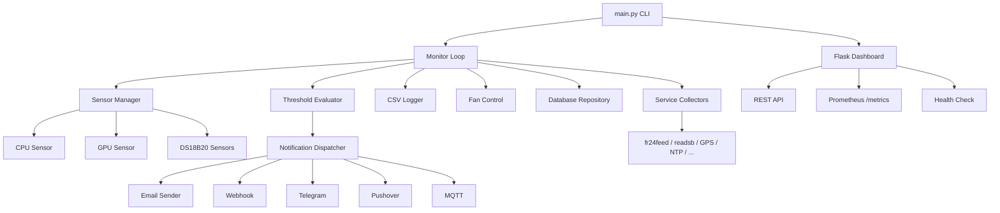
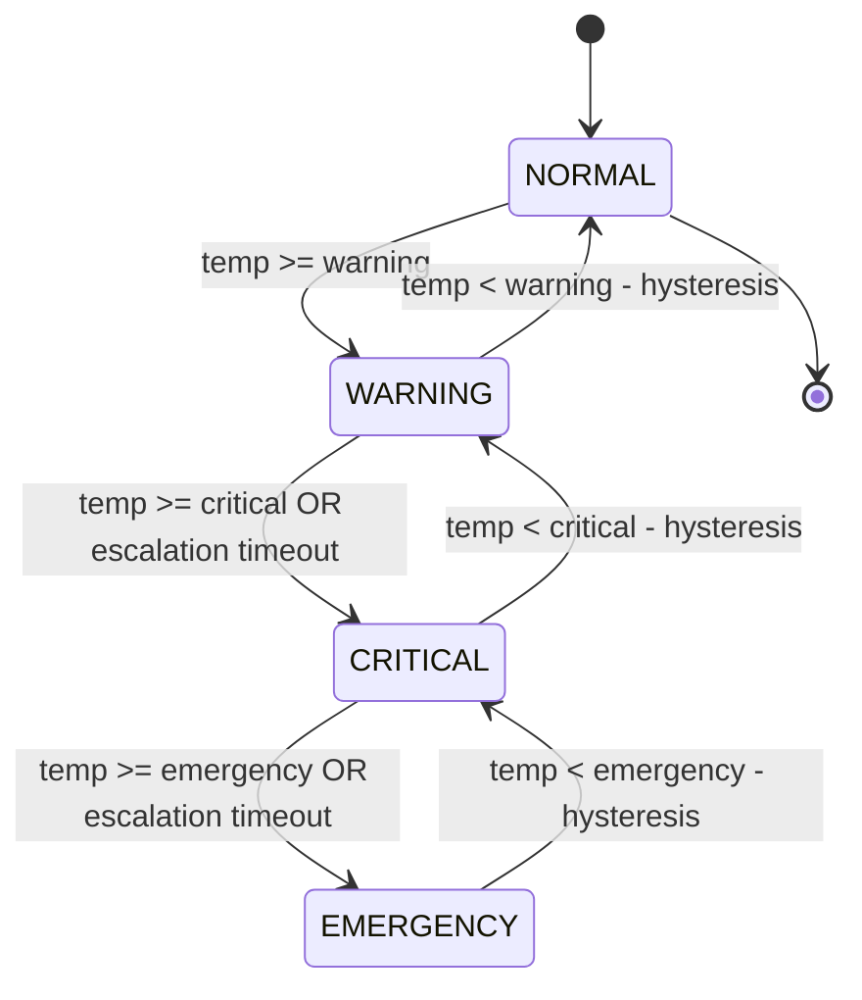

# PiMon

A comprehensive Raspberry Pi system monitoring, alerting, and service statistics platform. Monitors temperatures, system resources, and 19 auto-detected services with multi-channel alerting, Home Assistant MQTT integration, and a real-time web dashboard.

## What It Does

**Install it. It works.** PiMon auto-detects what's running on your Pi and starts monitoring immediately.

- Reads CPU/GPU temperature every 30 seconds
- Sends you an email (or Telegram, Pushover, webhook) if it gets too hot
- Publishes everything to MQTT with Home Assistant auto-discovery - entities just appear
- Auto-detects 19 co-hosted services (ADS-B feeders, Pi-hole, Docker, WireGuard, etc.) and publishes their stats
- Serves a real-time dashboard on port 5000 with historical charts
- Exposes Prometheus metrics at `/metrics` for Grafana
- Stores all data in SQLite (or MySQL/PostgreSQL if you prefer)
- Designed for SD card longevity - batched writes, WAL mode, low-write option

## Quick Start

```bash
git clone https://github.com/disappointingsupernova/pimon
cd pimon
sudo ./install.sh
sudo nano /opt/pimon/.env
sudo systemctl start pimon
```

Then open `http://your-pi-ip:5000` in a browser.

## CLI

```bash
pimon status          # Current sensor readings
pimon history -n 50   # Last 50 temperature records
pimon logs -f         # Follow live logs
pimon config          # Show all settings (secrets redacted)
pimon test-email      # Verify SMTP works
sudo pimon update     # Pull latest + restart
```

| Command       | Description                                          | Options                          |
|---------------|------------------------------------------------------|----------------------------------|
| `start`       | Start the monitoring daemon                          | -                                |
| `status`      | Show current sensor readings                         | -                                |
| `history`     | Display recent temperature history                   | `-n`, `--lines` (default: 20)   |
| `logs`        | View application log output                          | `-n`, `--lines` (default: 50), `-f`, `--follow` |
| `test-email`  | Send a test email to verify SMTP config              | -                                |
| `config`      | Display current configuration                        | -                                |
| `update`      | Pull latest changes and restart service (requires root) | -                             |
| `migrate-db`  | Migrate data between database backends               | `--source URL`, `--target URL` (required) |

## Architecture



## Alert State Machine



## Documentation

| Topic | Description |
|-------|-------------|
| [Installation](docs/installation.md) | Production install, dev setup, updating, uninstalling |
| [Configuration](docs/configuration.md) | Full .env reference with all fields, types, and defaults |
| [MQTT and Home Assistant](docs/mqtt-homeassistant.md) | Broker setup, topic structure, HA automations, multi-Pi, Grafana |
| [Service Collectors](docs/service-collectors.md) | All 19 auto-detected services with payloads and HA entities |
| [API Endpoints](docs/api.md) | REST API, Prometheus metrics, authentication, rate limiting |
| [SD Card Longevity](docs/sd-card-longevity.md) | Write optimisation, low-write mode, manual tuning |
| [DS18B20 Sensors](docs/ds18b20.md) | Wiring, one-wire setup, configuration |

## Project Structure

```
PiMon/
|-- main.py                  # CLI entry point
|-- requirements.txt         # Python dependencies
|-- install.sh               # Production installer (requires root)
|-- uninstall.sh             # Clean removal script (requires root)
|-- .env.example             # Configuration template
|-- SECURITY.md              # Security policy and guidance
|-- CONTRIBUTING.md          # Contribution guidelines
|-- LICENCE                  # MIT licence
|-- docs/                    # Detailed documentation
|-- systemd/
|   `-- pimon.service        # Systemd unit file (reference template)
`-- src/
    |-- config.py            # Configuration loader and validation
    |-- logger.py            # Logging and CSV setup with daily rotation
    |-- monitor.py           # Core monitoring loop
    |-- sensors/
    |   |-- base.py          # Sensor interface
    |   |-- cpu.py           # CPU temperature sensor
    |   |-- gpu.py           # GPU temperature sensor
    |   |-- ds18b20.py       # DS18B20 one-wire sensor
    |   |-- manager.py       # Sensor orchestration
    |   |-- system_metrics.py # CPU/memory/disk/swap/load/network metrics
    |   |-- fan_control.py   # GPIO fan control
    |   `-- collectors/      # Auto-detecting service collectors
    |-- alerting/
    |   |-- thresholds.py    # Threshold evaluation and hysteresis
    |   |-- email_sender.py  # SMTP email dispatch (plain + HTML)
    |   |-- dispatcher.py    # Multi-channel notification fan-out
    |   |-- digest.py        # Daily summary email
    |   `-- notifiers/       # Webhook, Telegram, Pushover, MQTT
    |-- database/
    |   |-- models.py        # SQLAlchemy models and engine setup
    |   |-- repository.py    # Query and persistence helpers
    |   `-- migrate.py       # Database migration between backends
    `-- dashboard/
        |-- app.py           # Flask web application
        `-- templates/
            `-- index.html   # Dashboard UI template
```

## Licence

MIT - see [LICENCE](LICENCE) for full text.
