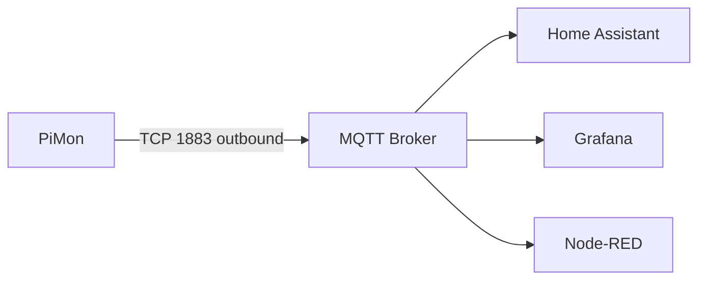

# MQTT and Home Assistant Integration

## Network Architecture

PiMon **pushes** data outbound to an MQTT broker. It does not require any inbound connections.



## Firewall Rules

If the Pi and Home Assistant are on different VLANs/subnets, you need one firewall rule:

| Source | Destination | Port | Protocol | Direction |
|--------|-------------|------|----------|-----------|
| Pi IP  | HAOS IP     | 1883 | TCP      | Outbound from Pi |

For TLS-encrypted MQTT, use port 8883 instead.

No inbound rules are needed on the Pi - the MQTT command topic works over the same persistent outbound TCP connection.

## HAOS Mosquitto Setup

1. In Home Assistant, go to **Settings > Add-ons > Add-on Store**
2. Install **Mosquitto broker**
3. Configure a user in **Settings > People > Users** (or use a local MQTT user)
4. Start the Mosquitto add-on
5. Note your HAOS IP address (e.g. `192.168.1.100`)

## Pi Configuration

Edit `.env` on the Pi:

```bash
MQTT_ENABLED=true
MQTT_HOST=192.168.1.100      # Your HAOS IP address
MQTT_PORT=1883
MQTT_USERNAME=mqtt_user       # The user you created in HAOS
MQTT_PASSWORD=mqtt_password
MQTT_CLIENT_ID=pimon
MQTT_TOPIC_PREFIX=pimon
```

Restart the service:

```bash
sudo systemctl restart pimon
```

## Verifying the Connection

Check the logs for a successful connection:

```bash
pimon logs | grep MQTT
# Should show: MQTT connected to 192.168.1.100:1883 (hostname: mypi, LWT enabled)
```

In Home Assistant, go to **Settings > Devices & Services > MQTT**. You should see a new device called "PiMon (hostname)" with all sensors auto-discovered.

## Topic Structure

All topics include the Pi's hostname for multi-device support:

| Topic | Content | Retained |
|-------|---------|----------|
| `pimon/<hostname>/sensor/<name>/state` | Temperature per sensor | Yes |
| `pimon/<hostname>/system/state` | Full system metrics (CPU, memory, disk, swap, load, network, processes, uptime) | Yes |
| `pimon/<hostname>/alerts` | Alert events with level and temperature | No |
| `pimon/<hostname>/recovery` | Recovery events | No |
| `pimon/<hostname>/status` | "online" / "offline" (LWT) | Yes |
| `pimon/<hostname>/command` | Inbound commands (subscribed) | - |

## Last Will and Testament (LWT)

If the Pi loses power or the process crashes, the MQTT broker automatically publishes `"offline"` to the status topic. Home Assistant marks all entities from this device as **unavailable** immediately without polling.

## Remote Commands

Publish JSON to `pimon/<hostname>/command` to remotely control the Pi:

```json
{"action": "test_alert"}              // Trigger a test alert
{"action": "status"}                  // Force republish online status
{"action": "reboot"}                  // Reboot the Pi
{"action": "poll_interval", "value": 60}  // Request interval change (logged)
```

You can send these from the Home Assistant MQTT integration, Node-RED, or any MQTT client.

## Home Assistant Automation Examples

Alert events are published with a `level` field that you can use in automations:

```yaml
# Flash a light red on emergency temperature
automation:
  - alias: "Pi Temperature Emergency"
    trigger:
      - platform: mqtt
        topic: "pimon/+/alerts"
    condition:
      - "{{ trigger.payload_json.level == 'EMERGENCY' }}"
    action:
      - service: light.turn_on
        target:
          entity_id: light.office_lamp
        data:
          color_name: red
          brightness: 255
      - service: notify.mobile_app
        data:
          title: "Pi Temperature Emergency"
          message: "{{ trigger.payload_json.hostname }}: {{ trigger.payload_json.temperature_c }} C"
```

```yaml
# Send HA notification on any alert
automation:
  - alias: "Pi Temperature Warning"
    trigger:
      - platform: mqtt
        topic: "pimon/+/alerts"
    action:
      - service: notify.persistent_notification
        data:
          title: "Pi Alert: {{ trigger.payload_json.level }}"
          message: "{{ trigger.payload_json.hostname }} sensor {{ trigger.payload_json.sensor }} at {{ trigger.payload_json.temperature_c }} C"
```

## Multi-Pi Setup

Multiple Pis can publish to the same broker. Each uses its own hostname in the topic path:

```
pimon/pi-living-room/sensor/cpu/state
pimon/pi-garage/sensor/cpu/state
pimon/pi-server/sensor/cpu/state
```

To aggregate in Grafana or Node-RED, subscribe to `pimon/+/system/state` (the `+` is a single-level wildcard). Each payload includes a `hostname` field for filtering.

In Home Assistant, each Pi appears as a separate device with its own entities.

## Grafana via MQTT

With the [Grafana MQTT datasource plugin](https://grafana.com/grafana/plugins/grafana-mqtt-datasource/):

1. Install the MQTT datasource plugin in Grafana
2. Add a new MQTT datasource pointing to your broker
3. Subscribe to `pimon/+/system/state`
4. The flat JSON payload maps directly to Grafana fields without transformation

## Node-RED Integration

Subscribe to topics with MQTT-in nodes:

- `pimon/+/alerts` - Process all alerts from all Pis
- `pimon/+/system/state` - Monitor system health across all Pis
- `pimon/specific-hostname/sensor/cpu/state` - Track a specific sensor

Use the `hostname` field in payloads to route, filter, or aggregate data.
